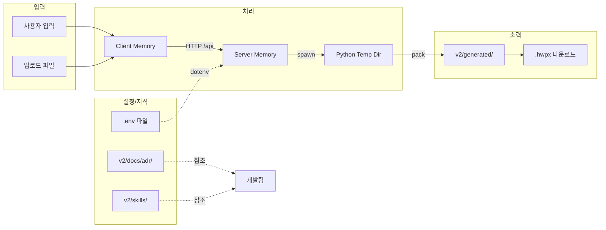

# 데이터베이스 설계서 (Database Design Document)

| 항목 | 내용 |
|------|------|
| **프로젝트명** | HWP/HWPX AI 문서 생성 데모 서비스 (v2) |
| **문서 버전** | v1.1 |
| **작성일** | 2026-04-20 |
| **최종 수정일** | 2026-04-20 |
| **작성자** | 개발팀 |
| **문서 상태** | 승인됨 |

---

## 1. 개요

### 1.1 데이터 저장소 전략

본 서비스는 **데이터베이스를 사용하지 않는 Stateless 아키텍처**로 설계되었다. 모든 데이터는 요청-응답 주기 내에서 메모리 또는 임시 파일로 처리되며, 영구 저장이 필요한 설정값은 파일 시스템(`.env`)에 저장한다.

### 1.2 설계 결정 근거

| 결정 사항 | 근거 |
|-----------|------|
| DB 미사용 | 데모 도구로서 사용자 계정, 세션, 이력 관리가 불필요함 |
| `.env` 파일 설정 저장 | API 키, OAuth 토큰 등 민감 설정값의 간단한 영속화 |
| 임시 파일 사용 | 업로드된 HWPX 템플릿, sections JSON, 생성된 HWPX는 프로세스 종료 후 삭제 |
| 클라이언트 상태 관리 | React `useState`로 모든 UI 상태 관리, 서버에 상태 저장 없음 |
| ADR/Skills/Hooks 파일 저장 | 지식 관리 및 자동화 워크플로우를 파일 시스템 기반으로 관리 |

---

## 2. 데이터 저장소 구성

### 2.1 저장소 목록

| 저장소 | 유형 | 용도 | 영속성 |
|--------|------|------|--------|
| `v2/server/.env` | 텍스트 파일 | API 키, OAuth 토큰, 포트 설정 | 영구 (수동 관리) |
| `v2/generated/` | 파일 시스템 디렉터리 | 생성된 `.hwpx` 파일 임시 저장 | 비영구 (주 1회 정리) |
| OS 임시 디렉터리 | 임시 폴터 | Python 빌드 중 HWPX 언패킹 작업 공간 | 비영구 (`tempfile.TemporaryDirectory`) |
| 브라우저 메모리 | RAM | React 상태, WASM 파싱 결과, AI 초안 데이터 | 비영구 (페이지 새로고침 시 초기화) |
| 서버 메모리 | RAM | Express OAuth state Map, Provider 설정 캐시 | 비영구 (서버 재시작 시 초기화) |
| `v2/docs/adr/` | Markdown 파일 | 아키텍처 결정 기록 | 영구 (Git 버전 관리) |
| `v2/skills/` | Markdown 파일 | 개발 워크플로우 가이드 | 영구 (Git 버전 관리) |
| `v2/hooks/` | Shell 스크립트 | 자동화 훅 | 영구 (Git 버전 관리) |
| `v2/tools/` | Python/Shell | 검증/테스트 도구 | 영구 (Git 버전 관리) |

### 2.2 `.env` 파일 스키마

```ini
# 서버 설정
PORT=8788
CLIENT_ORIGIN=http://127.0.0.1:5188
OAUTH_REDIRECT_BASE=http://127.0.0.1:8788

# AI Provider API Keys
ANTHROPIC_API_KEY=sk-ant-...
OPENAI_API_KEY=sk-...
KIMI_API_KEY=...
XAI_API_KEY=...

# OAuth Credentials (Provider별)
ANTHROPIC_CLIENT_ID=...
ANTHROPIC_CLIENT_SECRET=...
OPENAI_CLIENT_ID=...
# ... 기타 Provider OAuth 설정
```

### 2.3 파일 저장 규칙

| 파일 유형 | 저장 경로 | 파일명 규칙 | 보관 기간 |
|-----------|-----------|-------------|-----------|
| 생성 HWPX | `v2/generated/` | `{slugify(title)}-{timestamp}.hwpx` | 수동 삭제 전까지 |
| 업로드 HWPX (템플릿) | `v2/generated/` | `{timestamp}-{sanitized(originalname)}` | 생성 완료 후 즉시 삭제 |
| sections JSON | `v2/generated/` | `{timestamp}-sections.json` | 생성 완료 후 즉시 삭제 |
| ADR | `v2/docs/adr/` | `000N-decision-title.md` | 영구 |
| Skills | `v2/skills/` | `skill-name.md` | 영구 |
| Hooks | `v2/hooks/` | `hook-name.sh` | 영구 |
| Tools | `v2/tools/` | `tool-name.sh` / `tool-name.py` | 영구 |

---

## 3. 데이터 흐름도



---

## 4. 데이터 보안

| 항목 | 조치 |
|------|------|
| `.env` 파일 | `.gitignore`에 등록하여 버전 관리 제외 |
| 생성 파일 | localhost 접근만 가능, 외부 노출 차단 |
| 임시 파일 | `finally` 블록에서 무조건 `fs.unlink` 수행 |
| 메모리 데이터 | 서버 재시작 시 완전 초기화, 스왑 방지 위해 민감 데이터는 짧게 유지 |
| ADR/Skills | 민감 정보 제외, 기술 결정 사항만 기록 |

---

## 5. 향후 DB 도입 검토

| 단계 | 조건 | 도입 DB | 데이터 |
|------|------|---------|--------|
| Phase 2 | SaaS 전환 시 | PostgreSQL | 사용자 계정, 문서 이력, 버전 관리 |
| Phase 2 | SaaS 전환 시 | Redis | 세션, OAuth state, rate limiting |
| Phase 3 | API 상품화 시 | PostgreSQL | API 키 관리, 사용량 집계, 청구 데이터 |
