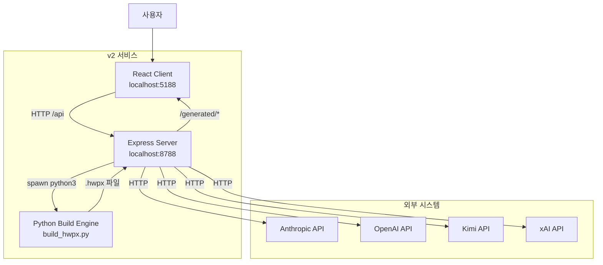

# 시스템 아키텍처 설계서 (SAD - System Architecture Document)

| 항목 | 내용 |
|------|------|
| **프로젝트명** | HWP/HWPX AI 문서 생성 데모 서비스 (v2) |
| **문서 버전** | v1.2 |
| **작성일** | 2026-04-20 |
| **최종 수정일** | 2026-04-21 |
| **작성자** | 개발팀 |
| **승인자** | 프로젝트 책임자 |
| **문서 상태** | 승인됨 |

---

## 1. 문서 개요

### 1.1 목적

본 문서는 v2 데모 서비스의 시스템 아키텍처를 정의하고, 주요 기술적 결정 사항과 설계 원칙을 기술한다. 개발팀이 시스템의 전체 구조를 이해하고 일관된 방향으로 개발을 수행할 수 있도록 한다.

### 1.2 범위

- 시스템 전체 아키텍처 구조 및 구성 요소
- 기술 스택 선정 및 근거
- 배포 아키텍처 (localhost)
- 비기능 요구사항에 대한 아키텍처 대응 전략
- 시스템 간 통합 패턴
- 자동화 인프라 (ADR, skills, hooks, tools)

### 1.3 참조 문서

| 문서명 | 버전 | 비고 |
|--------|------|------|
| 요구사항 정의서 (SRS) | v1.1 | 기능/비기능 요구사항 |
| 서비스 기획서 | v1.1 | MVP 스코프 |
| HWPX 포맷 문서 | - | 한글 문서 구조 참조 |
| ADR | - | `v2/docs/adr/` 참조 |

### 1.4 용어 정의

| 용어 | 정의 |
|------|------|
| WASM | WebAssembly. 브라우저 내 네이티브 속도 실행 바이너리 |
| rhwp | `@rhwp/core`. HWP/HWPX 파싱/렌더링 WASM 라이브러리 |
| HWPX | 한컴오피스 XML 기반 문서 포맷 (ZIP + XML) |
| Provider | AI 모델 제공자 (Anthropic, OpenAI, Kimi, xAI) |
| ADR | Architecture Decision Record |

---

## 2. 아키텍처 개요

### 2.1 아키텍처 스타일 선택

#### 선택된 아키텍처 스타일

**3-Tier Layered Architecture (Client - Server - Build Engine)**

프론트엔드(React), 백엔드(Express), 문서 빌드 엔진(Python)으로 분리된 3계층 구조. 서버는 상태를 가지지 않으며(Stateless), 모든 상태는 클라이언트 세션 내에서 관리된다.

#### 후보 아키텍처 스타일 비교

| 평가 항목 | 3-Tier Layered | Microservices | Serverless |
|-----------|----------------|---------------|------------|
| 구현 복잡도 | 낮음 | 높음 | 중간 |
| 확장성 | 중간 | 높음 | 높음 |
| 유지보수성 | 높음 | 중간 | 중간 |
| 팀 역량 적합성 | 높음 | 중간 | 중간 |
| 배포 유연성 | 높음 | 중간 | 높음 |
| 운영 복잡도 | 낮음 | 높음 | 낮음 |
| **종합 점수** | **선택** | - | - |

#### 선택 근거

- **로컬 데모 목적**: Docker 없이 `npm install && npm run dev`로 즉시 실행되어야 함
- **팀 규모**: 소규모 팀(1~2인)이 빠르게 개발/유지보수할 수 있는 단순한 구조가 적합
- **비기능 요구사항**: 30초 이내 전체 흐름 완료, 별도 인프라 불필요
- **Python 빌드 엔진**: HWPX XML 조작에는 Python의 lxml이 가장 효과적이므로 별도 프로세스로 분리

### 2.2 아키텍처 원칙

| 원칙 | 설명 | 적용 방법 |
|------|------|-----------|
| 관심사 분리 (SoC) | 각 계층은 단일 책임을 가짐 | Client=UI/파싱, Server=API/AI중계, Python=문서생성 |
| 느슨한 결합 | 모듈 간 의존성 최소화 | AI Provider는 설정 기반 동적 로딩, Python은 stdin/stdout 인터페이스 |
| 높은 응집도 | 관련 기능을 하나의 모듈로 그룹화 | `useDraft.js`에 생성 상태/로직 집중, `draft.js`에 AI 프롬프트/호출 집중 |
| DRY | 코드 및 로직 중복 방지 | `shared/` 폴터에 클라이언트/서버 공용 유효성 검사, 문서 유형 정의 공유 |
| 자기 학습 | 실패로부터 배우고 문서화 | ADR, lessons-learned, skills/hooks로 지식 축적 |

### 2.3 시스템 컨텍스트 다이어그램



### 2.4 시스템 컴포넌트 다이어그램

```mermaid
flowchart TB
    subgraph Client
        UI[App.jsx]
        UP[Uploader.jsx]
        CP[ControlPanel.jsx]
        PP[PreviewPanel.jsx]
        PS[ProviderSettings.jsx]
        H1[useRhwp.js]
        H2[useDraft.js]
        H3[useProviders.js]
        LB[lib/helpers.js]
        LD[lib/diagrams.js]
        RHWP[@rhwp/core WASM]
    end
    subgraph Server
        EXP[Express App]
        R1[routes/health.js]
        R2[routes/providers.js]
        R3[routes/draft.js]
        R4[routes/export.js]
        R5[routes/auth.js]
        S1[services/ai.js]
        S2[services/draft.js]
        S3[services/hwpxBuilder.js]
        L1[lib/providers-config.js]
        L2[lib/oauth.js]
    end
    subgraph Python
        BP[build_hwpx.py]
        DT[diagram_templates.py]
        HU[hwpx_utils.py]
    end
    subgraph Shared
        SH1[docTypes.js]
        SH2[validate.js]
        SH3[escape.js]
    end
    subgraph Infra
        ADR[v2/docs/adr/]
        SKL[v2/skills/]
        HOK[v2/hooks/]
        TOL[v2/tools/]
    end

    UI --> CP & PP & PS
    CP --> UP
    UP --> LB
    UI --> H1 & H2 & H3
    H1 --> RHWP
    H2 -->|POST /api/generate-draft| R3
    H2 -->|POST /api/export-hwpx| R4
    H3 -->|GET/POST /api/providers| R2
    EXP --> R1 & R2 & R3 & R4 & R5
    R3 --> S2 --> S1
    R4 --> S3
    S1 -->|SDK/HTTP| AI1
    S3 -->|spawn| BP
    BP --> DT & HU
    S2 -.->|import| SH1 & SH2
    S3 -.->|import| SH2
```

---

## 3. 기술 스택

### 3.1 프론트엔드

| 기술 | 버전 | 역할 | 선정 근거 |
|------|------|------|-----------|
| React | ^18.3.1 | UI 컴포넌트 렌더링 | 선언적 UI, 풍부한 생태계, WASM 연동 용이 |
| Vite | ^5.4.21 | 빌드 도구 및 개발 서버 | 빠른 HMR, ESM 네이티브 지원, 프록시 설정 간편 |
| @rhwp/core | 0.7.2 | HWP/HWPX WASM 파서 | 브라우저 내 직접 파싱, 서버 부하 제로, SVG 출력 |

### 3.2 백엔드

| 기술 | 버전 | 역할 | 선정 근거 |
|------|------|------|-----------|
| Node.js | ESM | 런타임 | JavaScript/TypeScript 생태계, 비동기 I/O, Python spawn 용이 |
| Express | ^4.21.2 | 웹 프레임워크 | 경량, 미들웨어 확장성, CORS/정적 파일 지원 |
| Multer | ^2.0.2 | 파일 업로드 | 메모리 기반 처리(in-memory), 임시 파일 생성 최소화 |
| dotenv | ^17.4.2 | 환경변수 관리 | `.env` 기반 API 키 관리, 런타임 주입 |

### 3.3 AI SDK

| Provider | SDK/방식 | 비고 |
|----------|----------|------|
| Anthropic | `@anthropic-ai/sdk` ^0.90.0 | 공식 SDK, Claude 모델 |
| OpenAI | OpenAI-compatible HTTP | Kimi, xAI도 동일 인터페이스로 호출 |
| Kimi | OpenAI-compatible HTTP | `callOpenAICompatible` 함수 공유 |
| xAI | OpenAI-compatible HTTP | `callOpenAICompatible` 함수 공유 |

### 3.4 문서 빌드 엔진

| 기술 | 버전 | 역할 | 선정 근거 |
|------|------|------|-----------|
| Python 3 | 3.9+ | 스크립트 런타임 | lxml, zipfile 등 HWPX 조작에 최적화된 라이브러리 |
| lxml | - | XML 조작 | HWPX 낸부 XML(EPUB + OWPML) 파싱/수정/직렬화 |
| cairosvg | - (선택) | SVG → PNG | 다이어그램 이미지 임베딩용. 미설치 시 gracefully skip |

### 3.5 자동화 인프라

| 인프라 | 위치 | 역할 |
|--------|------|------|
| ADR | `v2/docs/adr/` | 아키텍처 결정 기록 (rhwp 버전 고정, preview=download byte identity, AI content integrity) |
| Skills | `v2/skills/` | 개발 워크플로우 가이드 (dependency-upgrade, dev-server-restart, verify-preview-equals-download) |
| Hooks | `v2/hooks/` | Git hooks / 자동화 (post-deps-change, pre-completion-checklist) |
| Tools | `v2/tools/` | smoke-test.sh, verify-hwpx-markers.py |

---

## 4. 상세 아키텍처 설계

### 4.1 클라이언트 아키텍처

```
client/src/
├── main.jsx          # ReactDOM.createRoot
├── App.jsx           # 전역 상태 관리, 흐름 오케스트레이션
├── components/
│   ├── TopBar.jsx           # Provider 상태 표시, 설정 진입
│   ├── Uploader.jsx         # 드래그 앤 드롭, 클릭 업로드, 파일 해제, 접근성
│   ├── ControlPanel.jsx     # 섹션 레이블(1,2), 입력 폼, 생성/다운로드 버튼
│   ├── PreviewPanel.jsx     # meta-grid, ParsedContent/DraftContent/BuiltContent
│   └── ProviderSettings.jsx # Provider 선택, API 키 입력, 연결 테스트
├── hooks/
│   ├── useRhwp.js    # WASM 초기화, 파싱, SVG 렌더링, 다중 페이지 추출
│   ├── useDraft.js   # AI 초안 생성, HWPX 납품 API 호출, 다운로드
│   └── useProviders.js # Provider 목록 조회, 설정 저장/테스트
└── lib/
    ├── helpers.js    # DOC_TYPES, buildOptimisticDraft, getDraftStageItems, formatSize, extractTextFromSvg, triggerDownload
    └── diagrams.js   # 클라이언트용 다이어그램 SVG 렌더링
```

### 4.2 서버 아키텍처

```
server/
├── index.js          # Express 앱 설정, 미들웨어, 라우터 마운트, 정적 파일
├── routes/
│   ├── health.js     # GET /api/health
│   ├── providers.js  # GET/POST /api/providers, POST /api/test-provider
│   ├── draft.js      # POST /api/generate-draft
│   ├── export.js     # POST /api/export-hwpx (multer, sourceMode/sourceText 추가)
│   └── auth.js       # GET /auth/:provider, GET /auth/:provider/callback
├── services/
│   ├── ai.js         # Anthropic/OpenAI-compatible API 호출 래퍼
│   ├── draft.js      # 프롬프트 빌드, AI 호출, JSON 검증, 재시도 로직
│   └── hwpxBuilder.js # Python 스크립트 spawn, 임시 파일 관리
└── lib/
    ├── env.js        # 환경변수 검증
    ├── errors.js     # HTTP 에러 클래스
    ├── oauth.js      # OAuth 2.0 흐름 (state 관리, 토큰 교환)
    ├── providers-config.js # Provider 메타데이터, 엔드포인트, 모델 정의
    ├── upload.js     # 파일명 디코딩, 업로드 검증 (magic bytes)
    └── utils.js      # 슬러그 생성, 프로세스 실행 래퍼
```

### 4.3 데이터 흐름

#### 흐름 1: 파일 업로드 및 파싱 (개선)

1. 사용자가 파일 드래그 앤 드롭 또는 클릭 → `Uploader.handleDrop` / `handleInputChange`
2. 확장자/크기 검증 → `Uploader.isAcceptedFile`
3. `App.handleFileSelect` 호출 → `useRhwp.parseFile`
4. `@rhwp/core` WASM으로 `ArrayBuffer` 파싱
5. 첫 페이지 SVG 렌더링 + 텍스트 추출 → 상태 저장
6. `sourceInsight.mode` 결정 (`hwpx-template` 또는 `hwp-source`)
7. **백그라운드**: `enrichAdditionalPages`로 2~3페이지 추가 텍스트 추출
8. `Uploader`에 파일명, 크기, 페이지 수, 형식 표시

#### 흐름 2: AI 초안 생성

1. "초안 생성" 클릭 → `App.handleGenerate`
2. `useDraft.generateDraft` → Optimistic Draft 즉시 표시 (`buildOptimisticDraft`)
3. `POST /api/generate-draft` → `draft.js`
4. 프롬프트 빌드 → `ai.js` 통해 Provider 호출
5. JSON 추출 및 검증 (`shared/validate.js`) → 실패 시 1회 재시도
6. 클라이언트에 `{title, summary, toc, sections, diagrams}` 반환
7. `PreviewPanel`에 초안 렌더링 (`DraftContent`)

#### 흐름 3: HWPX 납품 (개선)

1. 초안 수신 후 자동 `buildHwpx` 호출
2. `POST /api/export-hwpx` (multipart) → `export.js` → `hwpxBuilder.js`
3. Python `build_hwpx.py` spawn:
   - 템플릿 HWPX 언패킹 (`hwpx_utils.unpack_hwpx`)
   - `apply_smart_replacements`: XML 텍스트 노드 치환 (title, meta, heading, body)
   - `embed_diagrams`: SVG → PNG 변환, `<hp:pic>` 임베딩
   - `update_preview`, `update_metadata`
   - `pack_hwpx`로 재패키징
4. 생성된 파일을 `/generated/<name>`으로 반환
5. 클라이언트가 다시 `@rhwp/core`로 렌더링하여 최종 확인 (`BuiltContent`)
6. ControlPanel에 다운로드 링크 직접 표시

---

## 5. 배포 아키텍처

### 5.1 개발 환경

```
[사용자 PC]
  ├── Client (Vite dev server) : http://127.0.0.1:5188
  │   └── /api  ──프록시──▶ Server
  │   └── /generated ──프록시──▶ Server
  └── Server (Express)         : http://127.0.0.1:8788
      └── Python 3 (spawn)     : scripts/build_hwpx.py
```

### 5.2 실행 명령

```bash
cd v2
npm install
npm run dev   # concurrently로 client + server 동시 실행
```

### 5.3 환경변수

| 변수 | 기본값 | 설명 |
|------|--------|------|
| `PORT` | 8788 | Express 서버 포트 |
| `CLIENT_ORIGIN` | `http://127.0.0.1:5188` | CORS 허용 Origin |
| `ANTHROPIC_API_KEY` | - | Anthropic API 키 |
| `OPENAI_API_KEY` | - | OpenAI API 키 |
| `KIMI_API_KEY` | - | Kimi API 키 |
| `XAI_API_KEY` | - | xAI API 키 |

---

## 6. 비기능 요구사항 대응

| 비기능 요구사항 | 아키텍처 대응 방안 |
|-----------------|-------------------|
| 성능 (≤30초 전체 흐름) | WASM 브라우저 파싱(서버 부하 0), Python 병렬 처리 없이 순차 실행으로 충분 |
| 보안 (localhost only) | Express를 `127.0.0.1`에 바인딩, CORS Origin 제한 |
| 신뢰성 (AI 실패 재시도) | `draft.js` 내 2회 시도 루프, 실패 시 명확한 에러 메시지 반환 |
| 사용성 (Docker 불필요) | npm workspaces + concurrently로 단일 명령 실행 |
| 확장성 (추가 Provider) | `providers-config.js`에 설정 추가만으로 신규 Provider 지원 |
| 접근성 (ARIA/키보드) | `Uploader`에 role/aria-label/tabIndex/Enter/Space 키 핸들러 |

---

## 7. 위험 및 대응

| 위험 ID | 위험 내용 | 영향도 | 대응 방안 |
|---------|-----------|--------|-----------|
| R-001 | `@rhwp/core` WASM 호환성 이슈 | 중간 | Chrome/Safari/Firefox 최신 버전만 지원, fallback 안내 |
| R-002 | AI Provider API 변경 | 낮음 | SDK 버전 고정, OpenAI-compatible 인터페이스 공유 |
| R-003 | `cairosvg` 설치 실패 | 낮음 | Graceful skip 처리, 다이어그램 없이도 HWPX 생성 가능 |
| R-004 | HWPX 양식 호환성 | 중간 | 기본 제공 템플릿(gonmun.hwpx) 검증, 업로드 양식은 best-effort |
| R-005 | Python 3 미설치 | 높음 | README에 Python 3.9+ 설치 필수 명시, 실행 스크립트 검사 |
