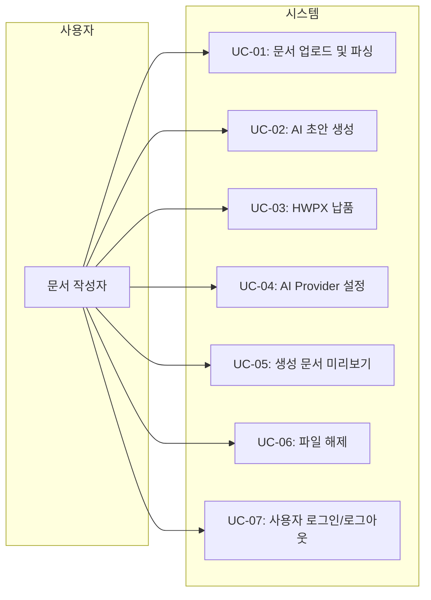

# 유스케이스 명세서 (Use Case Specification)

> 본 문서는 HWP/HWPX AI 문서 생성 데모 서비스(v2)의 주요 유스케이스를 정의한다.

| 항목 | 내용 |
|------|------|
| **프로젝트명** | HWP/HWPX AI 문서 생성 데모 서비스 (v3) |
| **문서 버전** | v1.3 |
| **작성일** | 2026-04-20 |
| **작성자** | 개발팀 |

---

## 유스케이스 다이어그램

---

## UC-01: 문서 업로드 및 파싱

| 항목 | 내용 |
|------|------|
| **유스케이스 ID** | UC-01 |
| **유스케이스명** | 문서 업로드 및 파싱 |
| **액터** | 문서 작성자 |
| **우선순위** | P0 |
| **선행 조건** | 브라우저에서 서비스 접속, WASM 로드 완료 |
| **후행 조건** | SVG 미리보기 표시, 추출 텍스트가 상태에 저장됨 |

### 기본 흐름 (Main Flow)

1. 사용자는 드래그 앤 드롭 존에 파일을 놓거나, 클릭해서 파일 탐색기를 연다.
2. 시스템은 파일 확장자와 크기를 검증한다.
3. 사용자는 `.hwp` 또는 `.hwpx` 파일을 선택한다.
4. 시스템은 파일을 메모리로 로드하고 `@rhwp/core` WASM 파서를 초기화한다.
5. 시스템은 문서를 파싱하여 첫 페이지를 SVG로 렌더링한다.
6. 시스템은 문서에서 텍스트를 추출하여 상태에 저장한다.
7. 시스템은 파일 확장자에 따라 모드를 결정한다:
   - `.hwpx` → 템플릿 재사용 모드
   - `.hwp` → 소스 분석 모드
8. 시스템은 SVG 미리보기와 추출 텍스트 요약을 화면에 표시한다.
9. 시스템은 백그라운드로 2~3페이지의 추가 텍스트를 추출한다.
10. 시스템은 Uploader에 파일명, 크기, 페이지 수, 문서 형식을 표시한다.

### 예외 흐름 (Exception Flow)

| 단계 | 조건 | 처리 |
|------|------|------|
| 2 | 확장자 불일치 | `role="alert"` 오류 메시지: "지원하지 않는 파일 형식입니다" |
| 2 | 20MB 초과 | 오류 메시지 표시 |
| 4 | WASM 초기화 실패 | 오류 메시지 표시: "문서 파서를 로드할 수 없습니다. 페이지를 새로고침해 주세요." |
| 5 | 파싱 실패 | 오류 메시지 표시: "지원하지 않는 문서 형식이거나 손상된 파일입니다." |

---

## UC-02: AI 초안 생성

| 항목 | 내용 |
|------|------|
| **유스케이스 ID** | UC-02 |
| **유스케이스명** | AI 초안 생성 |
| **액터** | 문서 작성자 |
| **우선순위** | P0 |
| **선행 조건** | UC-01 완료, AI Provider 설정 완료 또는 API 키 존재 |
| **후행 조건** | AI 초안 데이터가 상태에 저장됨, 화면에 초안 렌더링됨 |

### 기본 흐름

1. 사용자는 문서 유형, 회사명, 제목, 목표, 메모를 입력한다.
2. 사용자는 "초안 생성" 버튼을 클릭한다.
3. 시스템은 Optimistic Draft를 생성하여 임시로 화면에 표시한다.
4. 시스템은 `POST /api/generate-draft`에 다음을 전송한다:
   - 추출 텍스트, 문서 유형, 회사명, 목표, 메모, 제목, Provider 정보
5. 서버는 AI Provider로 프롬프트를 전송한다.
6. AI는 JSON 형식의 초안을 응답한다.
7. 서버는 응답을 파싱 및 검증한다.
8. 서버는 검증된 초안을 클라이언트에 반환한다.
9. 클라이언트는 Optimistic Draft를 실제 AI 초안으로 교체한다.
10. 시스템은 섹션 목록, 본문, 다이어그램을 화면에 렌더링한다.
11. 시스템은 자동으로 `POST /api/export-hwpx`를 호출하여 HWPX 생성을 시작한다.

### 예외 흐름

| 단계 | 조건 | 처리 |
|------|------|------|
| 5 | API 키 미설정 | 오류 메시지: "API 키가 설정되지 않았습니다. 설정 패널에서 키를 입력해 주세요." |
| 6 | AI 응답 지연/실패 | 최대 1회 재시도, 실패 시 "AI 서버 연결에 실패했습니다." |
| 7 | JSON 파싱 실패 | 최대 1회 재시도, 실패 시 "AI 응답 형식이 올바르지 않습니다." |
| 7 | 필수 필드 누락 | 재시도, 실패 시 "생성된 초안의 형식이 올바르지 않습니다." |

---

## UC-03: HWPX 납품

| 항목 | 내용 |
|------|------|
| **유스케이스 ID** | UC-03 |
| **유스케이스명** | HWPX 납품 |
| **액터** | 문서 작성자 |
| **우선순위** | P0 |
| **선행 조건** | UC-02 완료 (AI 초안 생성 완료) |
| **후행 조건** | `.hwpx` 파일이 `v2/generated/`에 저장되고 다운로드 가능함 |

### 기본 흐름

1. 초안 생성 완료 후 자동으로 HWPX 납품이 시작된다.
2. 시스템은 `POST /api/export-hwpx`에 multipart/form-data로 전송한다:
   - title, toc, sections(JSON), diagrams(JSON), sourceFile, sourceMode, sourceText
3. 서버는 Python `build_hwpx.py`를 실행한다.
4. Python은 템플릿 HWPX를 언패킹하고, AI 내용으로 XML 텍스트를 치환한다.
5. Python은 다이어그램을 PNG로 변환하여 임베딩한다. (선택)
6. Python은 메타데이터와 미리보기 텍스트를 업데이트한다.
7. Python은 최종 HWPX 파일을 재패키징한다.
8. 서버는 생성된 파일의 다운로드 URL을 반환한다.
9. 클라이언트는 생성된 HWPX를 SVG로 렌더링하여 최종 미리보기를 표시한다.
10. ControlPanel에 다운로드 링크를 직접 표시한다.
11. 사용자는 "다운로드" 버튼 또는 링크로 파일을 받을 수 있다.

### 예외 흐름

| 단계 | 조건 | 처리 |
|------|------|------|
| 4 | 템플릿 파일 없음 | 오류: "템플릿 파일을 찾을 수 없습니다." |
| 5 | `cairosvg` 미설치 | 다이어그램 없이 HWPX 생성, 경고 로그 출력 |
| 7 | Python 예외 발생 | 임시 파일 cleanup, 오류: "HWPX 생성에 실패했습니다." |

---

## UC-04: AI Provider 설정

| 항목 | 내용 |
|------|------|
| **유스케이스 ID** | UC-04 |
| **유스케이스명** | AI Provider 설정 |
| **액터** | 문서 작성자 |
| **우선순위** | P1 |
| **선행 조건** | 시스템 접속 |
| **후행 조건** | 선택한 Provider가 활성화되고 API 키가 저장됨 |

### 기본 흐름

1. 사용자는 상단 바의 "설정" 버튼을 클릭한다.
2. 시스템은 Provider 설정 패널을 표시한다.
3. 사용자는 Provider(Anthropic/OpenAI/Kimi/xAI)를 선택한다.
4. 사용자는 API 키를 입력한다. (선택)
5. 사용자는 "테스트" 버튼으로 연결을 확인한다.
6. 시스템은 `POST /api/test-provider`로 1문장 테스트를 수행한다.
7. 성공 시 "연결 성공" 메시지를 표시하고, 키를 서버 `.env`에 저장한다.

### 예외 흐름

| 단계 | 조건 | 처리 |
|------|------|------|
| 6 | API 키 오류 | "API 키가 올바르지 않습니다." |
| 6 | 네트워크 오류 | "Provider 서버에 연결할 수 없습니다." |

---

## UC-05: 생성 문서 미리보기

| 항목 | 내용 |
|------|------|
| **유스케이스 ID** | UC-05 |
| **유스케이스명** | 생성 문서 미리보기 |
| **액터** | 문서 작성자 |
| **우선순위** | P0 |
| **선행 조건** | UC-01 또는 UC-03 완료 |
| **후행 조건** | 미리보기 화면에 SVG가 렌더링됨 |

### 기본 흐름

1. 시스템은 미리보기 대상 파일(HWPX)을 `@rhwp/core`로 로드한다.
2. 시스템은 파일의 페이지를 SVG로 렌더링한다.
3. 시스템은 SVG를 미리보기 패널에 표시한다.
4. 메타 정보(파일명, 페이지 수, 문서 유형, 상태)를 함께 표시한다.
5. 사용자는 스크롤을 통해 여러 페이지를 확인할 수 있다.

---

## UC-06: 파일 해제

| 항목 | 내용 |
|------|------|
| **유스케이스 ID** | UC-06 |
| **유스케이스명** | 파일 해제 |
| **액터** | 문서 작성자 |
| **우선순위** | P0 |
| **선행 조건** | UC-01 완료 (파일 업로드 상태) |
| **후행 조건** | 업로드 상태 초기화, 미리보기 클리어 |

### 기본 흐름

1. 사용자는 Uploader의 × 버튼을 클릭한다.
2. 시스템은 업로드된 파일 상태를 `null`로 초기화한다.
3. 시스템은 AI 초안, HWPX 미리보기, 추출 텍스트를 모두 클리어한다.
4. 시스템은 상태 메시지를 초기값으로 되돌린다.

---

## UC-07: 사용자 로그인/로그아웃

| 항목 | 내용 |
|------|------|
| **유스케이스 ID** | UC-07 |
| **유스케이스명** | 사용자 로그인/로그아웃 |
| **액터** | 문서 작성자 |
| **우선순위** | P1 |
| **선행 조건** | 시스템 접속 (버전 A 또는 B) |
| **후행 조건** | 사용자 세션이 생성되거나 제거됨 |

### 기본 흐름 (버전 B - 수동 로그인)

1. 사용자는 TopBar의 "Google 로그인" 버튼을 클릭한다.
2. 시스템은 `/auth/google` 팝업을 연다.
3. 팝업에서 Google OAuth 또는 Mock 로그인을 완료한다.
4. 시스템은 `postMessage`로 부모 창에 로그인 성공을 알린다.
5. 클라이언트는 `/api/me`를 호출하여 사용자 정보를 조회한다.
6. TopBar에 이메일과 "로그아웃" 버튼이 표시된다.

### 기본 흐름 (버전 A - 자동 오버레이)

1. 사용자가 http://localhost:5191에 접속한다.
2. 시스템은 `/api/me`를 확인하고, 미인증 상태면 `LoginOverlay`를 전체 화면에 표시한다.
3. 사용자는 오버레이의 로그인 버튼을 클릭한다.
4. 이후 버전 B의 2~6단계와 동일하게 진행된다.
5. 로그인 완료 후 오버레이가 자동으로 사라진다.

### 예외 흐름

| 단계 | 조건 | 처리 |
|------|------|------|
| 2 | `GOOGLE_CLIENT_ID` 미설정 | Mock 로그인 HTML 폼 반환 |
| 4 | 팝업 차단 | 사용자에게 팝업 차단 해제 안내 |
| 5 | 세션 만료 | `authenticated: false`, 로그인 버튼 재표시 |

---

## 유스케이스 추적 매트릭스

| 유스케이스 ID | SRS 요구사항 ID | 설계 문서 | 구현 모듈 |
|---------------|-----------------|-----------|-----------|
| UC-01 | FR-UPLOAD-001 ~ 010, FR-A11Y-001~003 | 화면설계서 | `client/src/components/Uploader.jsx`, `client/src/hooks/useRhwp.js` |
| UC-02 | FR-DRAFT-001 ~ 010 | 화면설계서 | `client/src/hooks/useDraft.js`, `server/services/draft.js` |
| UC-03 | FR-EXPORT-001 ~ 007 | API설계서 | `server/services/hwpxBuilder.js`, `scripts/build_hwpx.py` |
| UC-04 | FR-PROVIDER-001 ~ 004 | 화면설계서 | `client/src/components/ProviderSettings.jsx`, `server/routes/providers.js` |
| UC-05 | FR-UI-001 ~ 010 | 화면설계서 | `client/src/components/PreviewPanel.jsx` |
| UC-06 | FR-UPLOAD-009 | 화면설계서 | `client/src/components/Uploader.jsx`, `App.jsx` |
| UC-07 | FR-AUTH-001 ~ 006 | API설계서 | `useAuth.js`, `routes/googleAuth.js`, `LoginOverlay.jsx`, `TopBar.jsx` |
