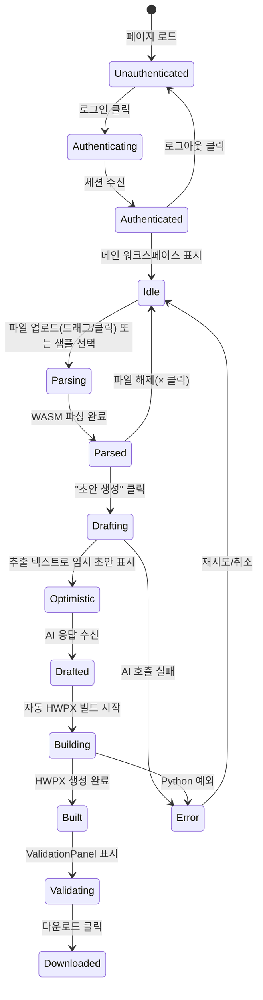

# 화면 설계서 (UI/UX Design Document)

| 항목 | 내용 |
|------|------|
| **프로젝트명** | HWP/HWPX AI 문서 생성 데모 서비스 (v4) |
| **문서 버전** | v1.4 |
| **작성일** | 2026-04-20 |
| **최종 수정일** | 2026-04-25 |
| **작성자** | 개발팀 |
| **문서 상태** | 승인됨 |

---

## 1. 개요

### 1.1 디자인 철학

- **데스크탑 우선**: 개발자/기획자용 데모 도구로 모바일 반응형은 고려하지 않음
- **단일 페이지 애플리케이션 (SPA)**: 업로드 → 설정 → 미리보기 → 생성 → 다운로드까지 한 화면에서 완료
- **진행 상태 가시화**: 각 단계(파싱, AI 생성, HWPX 빌드)의 상태를 텍스트로 명확히 표시
- **3단 미리보기**: 원본 문서 / AI 초안 / 최종 HWPX를 동일 패널에서 확인
- **접근성**: ARIA 속성, 키보드 조작, 초점 관리를 기본으로 지원

### 1.2 화면 목록

| 화면 ID | 화며이름 | 설명 |
|---------|----------|------|
| SCR-001 | 메인 워크스페이스 | 업로드, 입력, 미리보기, 생성/다운로드 버튼 |
| SCR-002 | Provider 설정 패널 | AI Provider 선택, API 키 입력, 연결 테스트 |
| SCR-003 | 로그인 오버레이 | 전체 화면 블러 배경 + Google/Mock 로그인 (버전 A) |
| SCR-004 | EmptyState | 파일 미업로드 시 3단계 가이드 + 샘플 카드 |
| SCR-005 | Toast 알림 | 우측 상단 자동 dismiss 알림 (info/success/warning/error) |
| SCR-006 | ValidationPanel | HWPX 유효성 검사 결과 분류 표시 |

---

## 2. 메인 워크스페이스 (SCR-001)

### 2.1 레이아웃 구조

```
+-------------------------------------------------------------+
|  [TopBar]  HWP/HWPX AI 문서 생성기    [설정]  Provider: ✅   |
+-------------------------------------------------------------+
|                                                             |
|  +------------------------+  +---------------------------+  |
|  |  [ControlPanel]        |  |  [PreviewPanel]           |  |
|  |                        |  |                           |  |
|  |  1. 원본 문서 업로드   |  |  +---------------------+  |  |
|  |  ┌──────────────────┐  |  |  | 문서 미리보기       |  |  |
|  |  │ 📁 드래그/클릭   │  |  |  | [meta-grid]         |  |  |
|  |  │ 파일명 · 2p      │  |  |  | [SVG 페이지 1]      |  |  |
|  |  └──────────────────┘  |  |  +---------------------+  |  |
|  |  헬퍼 텍스트           |  |  +---------------------+  |  |
|  |                        |  |  | AI 초안 / 결과물    |  |  |
|  |  2. 생성 조건          |  |  | ...                 |  |  |
|  |  문서 유형: [보고서 ▼] |  |  +---------------------+  |  |
|  |  회사명: [Bizmatrixx]  |  |                           |  |
|  |  제목: [2026 보고서]   |  |                           |  |
|  |  목표: [...] 0/400     |  |                           |  |
|  |  메모: [...] 0/300     |  |                           |  |
|  |                        |  |                           |  |
|  |  [초안 생성] [다운로드]|  |                           |  |
|  |  result.hwpx 다운로드  |  |                           |  |
|  |  상태: 파싱 완료...    |  |                           |  |
|  +------------------------+  +---------------------------+  |
|                                                             |
+-------------------------------------------------------------+
```

### 2.2 컴포넌트 상세

#### TopBar

| 요소 | 타입 | 설명 |
|------|------|------|
| 서비스명 | 텍스트 | "HWP/HWPX AI 문서 생성기" |
| Provider 상태 | 배지 | 현재 활성화된 Provider 이름 + 연결 상태(초록/빨강) |
| 설정 버튼 | 버튼 | 클릭 시 ProviderSettings 패널 열림 |
| 로그인 버튼 | 버튼 | 미인증 시 "Google 로그인" 표시, 클릭 시 팝업 열림 |
| 사용자 정보 | 텍스트 | 인증 시 이메일 표시 |
| 로그아웃 버튼 | 버튼 | 인증 시 "로그아웃" 표시 |

#### Uploader (신규/개선)

| 요소 | 타입 | 설명 |
|------|------|------|
| 드롭존 | div | `role="button"`, `tabIndex={0}`, `aria-label` 포함 |
| 빈 상태 | 아이콘 + 텍스트 | "HWP / HWPX 파일을 여기에 끌어다 놓거나 클릭" |
| 드래그 중 | 강조 스타일 | "여기에 놓아 업로드" 텍스트 변경, 색상 강조 |
| 채움 상태 | 파일 아이콘 + 메타 | 파일명, 크기, 페이지 수, 문서 형식(HWPX 양식/HWP 문서) |
| 해제 버튼 | button | × 아이콘, `aria-label="파일 해제"` |
| 거부 메시지 | alert | `role="alert"`, 지원하지 않는 형식/크과 시 표시 |

#### ControlPanel

| 요소 | 타입 | 기본값 | 검증 |
|------|------|--------|------|
| 섹션 레이블 1 | 텍스트 | "1. 원본 문서 업로드" | - |
| Uploader | 컴포넌트 | - | `.hwp`, `.hwpx`만, 20MB 제한 |
| 헬퍼 텍스트 | small | "HWP는 내용을 분석해 새 HWPX 초안을 만들고..." | - |
| 섹션 레이블 2 | 텍스트 | "2. 생성 조건" | - |
| 문서 유형 | select | `report` | report/proposal/minutes/gonmun/base |
| 회사명 | text input | `Bizmatrixx` | 비어있으면 기본값 사용 |
| 제목 | text input | 파일명에서 추출 | 빈 값 허용 (파일명 fallback) |
| 작성 목표 | textarea | "업로드한 문서의 핵심 내용을 바탕으로..." | 최대 400자, 실시간 카운터 |
| 추가 참고 | textarea | "핵심 메시지는 유지하고..." | 최대 300자, 실시간 카운터 |
| 초안 생성 버튼 | button | - | 업로드 필수, Provider 설정 확인 |
| 다운로드 버튼 | button | disabled | HWPX 생성 완료 후 활성화 |
| 다운로드 링크 | a | - | 생성 완료 시 파일명 링크 표시 |
| 상태 텍스트 | label | - | 파싱/생성/빌드/완료 상태 표시 |

#### PreviewPanel

| 섹션 | 설명 |
|------|------|
| 섹션 레이블 | "문서 미리보기" / "생성 초안 미리보기" / "HWPX 결과물 미리보기" |
| meta-grid | 4개 메타 아이템(파일명, 페이지 수, 문서 유형, 상태) 2×2 그리드 |
| 원본 미리보기 | `@rhwp/core` SVG 렌더링 + 추출 텍스트 패널. 업로드 직후 표시 |
| AI 초안 | `DraftContent`: 단계 바(stage line) + 제목 + 요약 + 목차 + 섹션 + 다이어그램 |
| 최종 HWPX 미리보기 | `BuiltContent`: 생성된 `.hwpx`를 다시 WASM으로 렌더링. 다중 페이지(최대 5p) |
| 푸터 | 상태 메시지 또는 설명 문구 |

#### EmptyState (SCR-004)

| 요소 | 타입 | 설명 |
|------|------|------|
| 3단계 가이드 | 텍스트+아이콘 | ① 업로드 → ② AI 초안 생성 → ③ 다운로드·검증 |
| 샘플 카드 목록 | 카드 그리드 | `/api/samples` 조회 결과 표시 (id, label, description) |
| 샘플 다운로드 | 버튼 | 클릭 시 `GET /api/samples/:id/file` → 업로더에 전달 |

#### Toast (SCR-005)

| 요소 | 타입 | 설명 |
|------|------|------|
| ToastContainer | fixed 영역 | 우측 상단, 여러 Toast 중첩 가능 |
| Toast 타입 | 배지+색상 | info(파랑), success(초록), warning(노랑), error(빨강) |
| 자동 dismiss | 타이머 | 기본 5초, error 8초 |
| 액션 버튼 | 버튼(선택) | 토스트 내 사용자 액션 유도 |

#### ValidationPanel (SCR-006)

| 요소 | 타입 | 설명 |
|------|------|------|
| 전체 상태 | 배지 | ok(초록) / warning(노랑) / error(빨강) |
| 카테고리 그룹 | 아코디언 | rule, structure, container, schema, other |
| 심각도 아이콘 | 아이콘 | error / warning / info |
| 확장/축소 | 토글 | 그룹별 상세 메시지 펼침/접힘 |

---

## 3. Provider 설정 패널 (SCR-002)

### 3.1 레이아웃

```
+-------------------------------------------------------------+
|  [TopBar]  HWP/HWPX AI 문서 생성기   [사용자명] [로그아웃]   |
+-------------------------------------------------------------+
|                                                             |
|  +------------------------+  +---------------------------+  |
|  |  [LoginOverlay]        |  |  [PreviewPanel]           |  |
|  |  블러 배경 전체 커버   |  |                           |  |
|  |  ┌──────────────────┐  |  |  ...                      |  |
|  |  │ 🔑 Google 로그인 │  |  |                           |  |
|  |  │ 또는 Mock 로그인 │  |  |                           |  |
|  |  └──────────────────┘  |  |                           |  |
|  +------------------------+  +---------------------------+  |
|                                                             |
+-------------------------------------------------------------+
```

### 3.2 LoginOverlay (SCR-003)

| 요소 | 타입 | 설명 |
|------|------|------|
| 배경 | div | `position: fixed`, 전체 viewport 커버, 블러 + 반투명 검정 |
| Google 로그인 버튼 | button | 클릭 시 `/auth/google` 팝업 열기 |
| Mock 로그인 폼 | form | client_id 미설정 시 표시, 이메일/이름 입력 |
| 자동 표시 | 조걵 | `!user` 상태일 때만 렌더링 |
| 자동 숨김 | 조걵 | `user` 상태 populated 시 제거 |

### 3.2 동작

| 동작 | 결과 |
|------|------|
| Provider 변경 | 해당 Provider의 기본 모델 정보 표시 |
| API 키 입력 | 메모리에만 저장, 서버로 `POST /api/settings` 전송 |
| 연결 테스트 | `POST /api/test-provider` 호출, 1문장 응답 확인 |
| OAuth 로그인 | `GET /auth/:provider`로 새 창 열기, 콜백 후 토큰 저장 |
| 저장 | `.env` 파일 업데이트, 패널 닫기 |

---

## 4. 상태 변화 흐름



---

## 5. 색상 및 타이포그래피

| 항목 | 값 |
|------|-----|
| 기본 배경 | `#ffffff` |
| 사이드바 배경 | `#f5f5f5` |
| 주요 버튼 | `#2563eb` (파랑) |
| 성공 상태 | `#16a34a` (초록) |
| 오류 상태 | `#dc2626` (빨강) |
| 드래그 강조 | `#3b82f6` (밝은 파랑) |
| 기본 폰트 | system-ui, -apple-system, sans-serif |
| 제목 폰트 크기 | 20px |
| 본문 폰트 크기 | 14px |
| 상태 텍스트 | 13px, 회색 |
